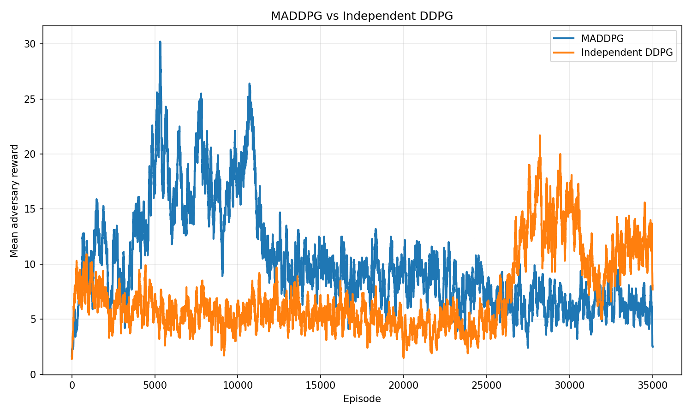
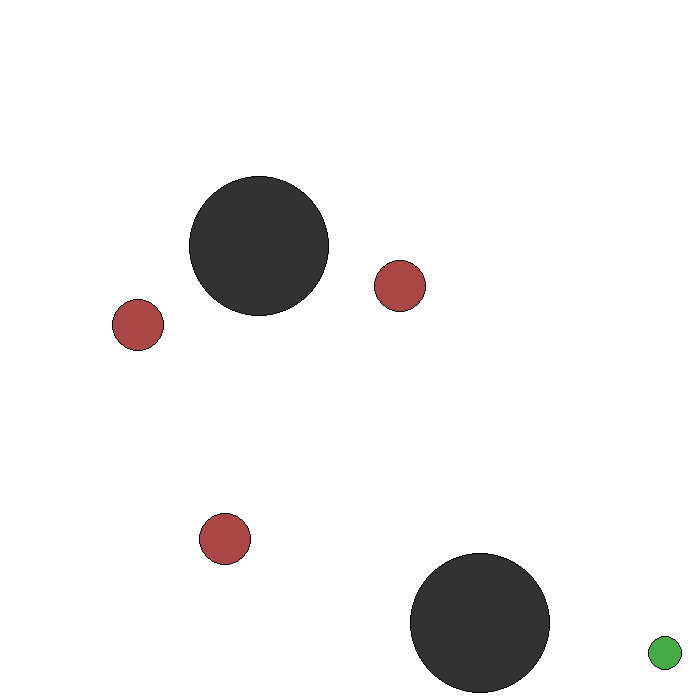
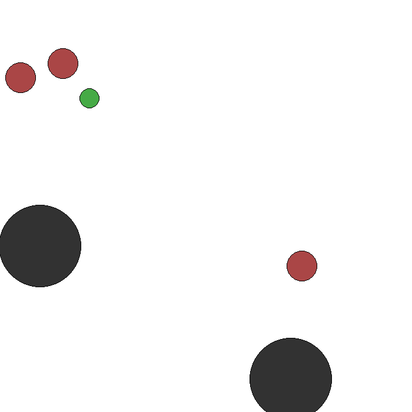

<!-- 
Author: f-matanza (https://github.com/f-matanza) 
Co-Author: danneba (https://github.com/danneba) 
-->

# 1. Motivation {.section-slide}

## Motivation

::: {.focus-grid}
::: {.focus-card .accent-teal}
Context
**Real-world AI is multi-agent.** Robotics, games, traffic control, and agentic AI systems all require agents that adapt around other agents.
:::

::: {.focus-card .accent-orange}
Core problem
Single-agent RL assumes a stable environment. In MARL, other learners keep changing the transition and reward dynamics.
:::

::: {.focus-card .accent-red}
Failure mode
Independent learners see other agents as an unpredictable part of the environment, which raises variance and breaks key Q-learning assumptions.
:::

::: {.focus-card .accent-green}
Solution idea
MADDPG uses **Centralized Training, Decentralized Execution** to stabilize learning while preserving deployable local policies.
:::
:::

## Multi-Agent Non-Stationarity

::: {.lead}
The central issue is that every agent is learning inside an environment made partly of other learning agents.
:::

::: {.equation-band .equation-hero}
**Multi-agent non-stationarity:**&nbsp;&nbsp;while agent $i$ learns $\pi_i(a_i \mid o_i)$, every other policy $\pi_j$ also changes, so the effective environment seen by $i$ is not fixed.
:::

::: {.focus-grid .compact-grid}
::: {.focus-card .accent-red}
Training signal
Replay data becomes stale because the behavior policies that generated it are no longer fixed.
:::

::: {.focus-card .accent-teal}
Credit assignment
The reward for one agent depends on joint behavior, not only on its own action.
:::
:::

# 2. Background & Problem Statement {.section-slide}

## RL Background: Single Agent

::: {.stack-grid}
::: {.panel style="padding:0.72em 0.82em;"}

Reinforcement Learning Loop

- **MDP:** state $s$, action $a$, reward $r$, transition dynamics.
- **Policy:** $\pi(a \mid s)$ or deterministic actor $\mu(s)$.
- **Objective:** maximize expected discounted return.
:::

::: {.panel style="padding:0.72em 0.82em;"}

Actor-Critic and DDPG

- **Actor:** selects continuous actions.
- **Critic:** estimates expected return.
- **DDPG:** off-policy learning with replay buffer, target networks, and soft updates $\tau$.
:::
:::

::: {.equation-band .center-equation}
Target-network update:&nbsp;&nbsp;$\theta' \leftarrow \tau \cdot \theta + (1-\tau)\cdot \theta'$
:::

## Multi-Agent Setting

::: {.arena-stack}
::: {.tight}
- **Formalism:** partially observable Markov game with $N$ agents.
- Each agent $i$ receives observation $o_i$, chooses action $a_i$, and receives reward $r_i$.
- **Environment:** PettingZoo MPE `simple_tag_v3` / `mpe2` predator-prey.
- **Scenario:** 3 slower predators vs. 1 faster prey with 2 obstacles.
- Coordination matters because a single predator is easy to evade.
:::

  

  

  
P

  
P

  
P

  
E

:::

## The Problem with Independent Learners

::: {.focus-grid}
::: {.focus-card .accent-red}
Non-stationarity
Each policy changes during training, so replay data becomes stale faster and the learning target keeps moving.
:::

::: {.focus-card .accent-orange}
High variance
Rewards depend on the joint action, but each learner only observes a local slice of the system.
:::

::: {.focus-card .accent-teal}
Baseline critic
Independent DDPG trains each agent with a local critic: $Q_i(o_i, a_i)$.
:::

::: {.focus-card .accent-green}
Consequence
Other agents appear as uncontrolled environment dynamics, making coordination difficult to learn.
:::
:::

# 3. Core Method / Architecture {.section-slide}

## Core Idea: CTDE

::: {.lead}
MADDPG separates **what information is available during training** from **what information is required at execution time**.
:::

::: {.stack-grid}
::: {.panel style="padding:0.75em 0.85em;"}

Centralized Training

- The critic observes all agents' observations and actions.
- It can assign credit using global context.
- This stabilizes gradients in cooperative, competitive, and mixed games.
:::

::: {.panel style="padding:0.75em 0.85em;"}

Decentralized Execution

- Each actor uses only its own local observation.
- No global state or explicit communication channel is required at deployment.
- The learned policy can be run independently per agent.
:::
:::

## Architecture Comparison

::: {.method-grid}
::: {.arch-card}

Independent DDPG Baseline

  
Actor

  
$\mu_i(o_i) \rightarrow a_i$

  
Critic

  
$Q_i(o_i, a_i)$

Each agent learns with local information only.

:::

::: {.arch-card}

MADDPG

  
Actor

  
$\mu_i(o_i) \rightarrow a_i$

  
Critic

  
$Q_i(o_1,\dots,o_N,a_1,\dots,a_N)$

Only the critic input changes, keeping the comparison focused.

:::
:::

## MADDPG Learning Flow

::: {.flow-stack}
::: {.flow-step}

1<strong>Joint replay</strong>

Store $(o_{all}, a_{all}, r_{all}, o'_{all})$ for all agents.
:::

::: {.flow-step}

2<strong>Critic update</strong>

Fit centralized targets with all next observations and target actors.
:::

::: {.flow-step}

3<strong>Actor update</strong>

Improve $\mu_i$ using the gradient of centralized $Q_i$ with respect to $a_i$.
:::

::: {.flow-step}

4<strong>Soft targets</strong>

Update target networks with $\theta' \leftarrow \tau\theta + (1-\tau)\theta'$.
:::
:::

::: {.equation-band}
Critic target for agent $i$:&nbsp;&nbsp;$y_i = r_i + \gamma Q'_i(\mathbf{x}', \mu'_1(o'_1), \dots, \mu'_N(o'_N))$
:::

# 4. Key Results & Evaluation {.section-slide}

## Paper Results: Lowe et al. (2020)

::: {.results-grid}
::: {.result-card .accent-teal}
MADDPG predators vs. DDPG prey

16.1touches / episode

:::

::: {.result-card .accent-orange}
DDPG predators vs. MADDPG prey

10.3touches / episode

:::
:::

::: {.quote-panel style="margin-top:0.85em;"}
**Interpretation:** centralized critics help predators learn coordinated chasing behavior, while independent learners struggle with the moving-target problem in multi-agent training.
:::

# 5. Our GitHub Project & Practical Showcase {.section-slide}

## Our Implementation

::: {.stack-grid}
::: {.tight}
- **Framework:** PyTorch + `mpe2`, the modern PettingZoo MPE fork.
- **Baseline:** Independent DDPG with local critics.
- **Method:** MADDPG with centralized critics.
- **Pipeline:** train $\rightarrow$ log rewards as CSV $\rightarrow$ plot curves $\rightarrow$ record GIFs.
:::

::: {.panel style="padding:0.85em;"}

Source Code

[github.com/f-matanza/maddpg-predator-prey](https://github.com/f-matanza/maddpg-predator-prey)

::: {.small .muted}
Custom implementation from scratch for the course project.
:::
:::
:::

## Evaluation Setup

::: {.two-col-grid}
::: {.tight}
- **Environment:** `simple_tag_v3`
- **Discount:** $\gamma = 0.95$
- **Soft update:** $\tau = 0.01$
- **Batch size:** 1024
- **Metric:** `adversary_reward_mean` per episode
:::

<i class="maddpg"></i> MADDPG<i class="iddpg"></i> Independent DDPG

:::

## Showcase: Independent DDPG Baseline

::: {.two-col-grid}
::: {.panel style="padding:0.8em;"}

Observed Behavior

Predators fail to coordinate reliably. They often chase the prey individually and get outmaneuvered.
:::

<strong>GIF slot</strong>
assets/iddpg_trained.gif

:::

## Showcase: MADDPG

::: {.two-col-grid}
::: {.panel style="padding:0.8em;"}

Observed Behavior

Predators exhibit clearer coordination. They split up and corner the faster prey near boundaries or obstacles.
:::

<strong>GIF slot</strong>
assets/maddpg_trained.gif

:::

# 6. Strengths & Limitations {.section-slide}

## Strengths & Limitations

::: {.stack-grid}
::: {.panel style="padding:0.8em;"}

Strengths

- Addresses multi-agent non-stationarity directly.
- Centralized critics stabilize training compared with independent learners.
- Execution remains decentralized; no communication channel is required.
:::

::: {.panel style="padding:0.8em;"}

Limitations

- Critic input grows with the number of agents.
- Very large swarms need stronger structure, such as attention, factorization, or mean-field approximations.
- Requires access to joint observations and actions during training.
:::
:::

# 7. Connection to Course Topics {.section-slide}

## Connection to Course Topics

::: {.focus-grid}
::: {.focus-card .accent-teal}
Lectures 2 & 3
MADDPG extends model-free actor-critic ideas from single-agent RL to multi-agent RL.
:::

::: {.focus-card .accent-red}
Non-stationarity
Vanilla Q-learning and policy gradients fail when the environment changes as other agents learn.
:::

::: {.focus-card .accent-green}
Swarms
CTDE provides a control-level foundation for reliable agent groups and swarm-like coordination.
:::

::: {.focus-card .accent-orange}
Agentic systems
Learned decentralized controllers can become lower-level skills used by higher-level orchestration systems.
:::
:::

# 8. Open Questions & Discussion {.section-slide}

## Open Questions & Discussion

::: {.discussion-list}
1. **Scalability:** How can centralized critics scale to thousands of agents without exploding input size?
2. **Communication:** What changes if agents can explicitly communicate during execution?
3. **Real-world transfer:** Where would MADDPG be useful outside games?
4. **Credit assignment:** How can we separate individual contribution from team-level reward?
:::

# Acknowledgements {.section-slide}

## Acknowledgements & References

::: {.reference-list}
- Lowe, R., Wu, Y., Tamar, A., Harb, J., Abbeel, O. P., & Mordatch, I. (2020). *Multi-Agent Actor-Critic for Mixed Cooperative-Competitive Environments*.
- Official repository: [github.com/openai/maddpg](https://github.com/openai/maddpg)
- Project repository: [github.com/f-matanza/maddpg-predator-prey](https://github.com/f-matanza/maddpg-predator-prey)
- The authors acknowledge the computational resources and services provided by Salzburg Collaborative Computing (SCC), funded by the Federal Ministry of Education, Science and Research (BMBWF) and the State of Salzburg.
:::
